# Hi there 👋

I'm Ryan, a passionate full-stack developer specializing in Discord bot development and cloud infrastructure. My passion for software lies in creating robust, scalable applications with clean code architecture. I take great care in the experience, performance, and code quality of everything I build.

- 🔭 I'm currently working on [ARINO](https://github.com/ryanwtf88/ARINO) - A feature-rich Discord music bot
- 🌱 I'm currently learning Rust, Go, and advanced Kubernetes orchestration
- 👯 I'm looking to collaborate on open source Discord bots and cloud-native projects
- 💬 Ask me about Discord.js, Node.js, TypeScript, or cloud infrastructure
- 📫 How to reach me: [Email](mailto:ryanwtf88@gmail.com) | [Instagram](https://instagram.com/ryanwtf88) | [Discord](https://discord.com/users/1085376019445321829)
- 😄 Pronouns: He/Him
- ⚡ Fun fact: I merge Hollow power, Shinigami technique, and Quincy precision in my code

### Programming Languages:

<table width="100%" height="100%" align="center">
 <tr>
  <td align="center">
    
  </td>
  <td align="center">
    
  </td>
  <td align="center">
    
  </td>
  <td align="center">
    
  </td>
  <td align="center">
    
  </td>
  <td align="center">
    
  </td>
 </tr>
</table>

### Frontend & Web:

<table width="100%" height="100%" align="center">
 <tr>
  <td align="center">
    
  </td>
  <td align="center">
    
  </td>
  <td align="center">
    
  </td>
  <td align="center">
    
  </td>
  <td align="center">
    
  </td>
  <td align="center">
    
  </td>
 </tr>
</table>

### Backend Frameworks:

<table width="100%" height="100%" align="center">
 <tr>
  <td align="center">
    
  </td>
  <td align="center">
    
  </td>
  <td align="center">
    
  </td>
  <td align="center">
    
  </td>
  <td align="center">
    
  </td>
 </tr>
</table>

### Databases:

<table width="100%" height="100%" align="center">
  <tr>
    <td align="center">
      
    </td>
    <td align="center">
      
    </td>
    <td align="center">
      
    </td>
    <td align="center">
      
    </td>
    <td align="center">
      
    </td>
  </tr>
</table>

### DevOps & Cloud:

<table width="100%" height="100%" align="center">
  <tr>
    <td align="center">
      
    </td>
    <td align="center">
      
    </td>
    <td align="center">
      
    </td>
    <td align="center">
      
    </td>
  </tr>
</table>

### Tools & Platforms:

<table width="100%" height="100%" align="center">
  <tr>
    <td align="center">
      
    </td>
    <td align="center">
      
    </td>
    <td align="center">
      
    </td>
    <td align="center">
      
    </td>
    <td align="center">
      
    </td>
  </tr>
</table>

## My GitHub Stats:

<table align="center" width="100%" height="100%">
<tr>
  <td align="center">
    
  </td>
  <td align="center">
    
  </td>
</tr>
<tr>
  <td colspan="2" align="center">
    
  </td>
</tr>
</table>

## My Projects

